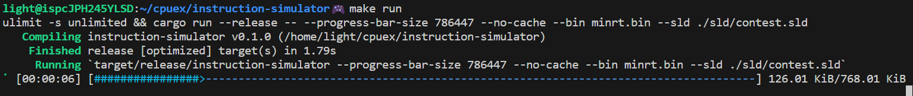

# Instruction-level simulator for for CPUEX-Group2 computer

## コンパイラ係向け
実行環境は WSL2 を推奨します。  
まず、アセンブラが出力した `minrt.bin` をこの `README.md` と同じディレクトリに置きます。
また `make` および `cargo` がインストールされていることを確認してください。その状態で
```sh
$ make run
```
を実行すると、シミュレータが起動し、実行を開始します。`Makefile` を見ると何となくわかると思いますが、`make run` では `minrt.bin` に対して `./sld/contest.sld` を入力として与えて実行するようになっています。
シミュレータの実行中、 `minrt.ppm` (この `README.md` と同じディレクトリ)に画像が出力されていきます。またプログレスバーで実行の進捗が表示されます(現在までの出力の合計バイト数の、256x256 で最終的に出力されるべき合計バイト数に対する割合に基づいています)。



面談ではシミュレータの実行終了後に `minrt.ppm` を見せればいいと思います。なお実行終了時にいくつかの統計情報のようなものが表示されますが、これは面談では関係ないと思います。

## 詳細
Rust により実装した、2班の命令レベルのシミュレータです。

### 動作環境
Cargo を用いてビルド・実行をすることが前提になっています。WSL2 で動作確認をしています。なお用いた Rust のバージョンおよび Cargo のバージョンは
```sh
$ rustc --version
rustc 1.70.0 (90c541806 2023-05-31)
$ cargo --version
cargo 1.70.0 (ec8a8a0ca 2023-04-25)
```
です。

### 実行方法
実行時のオプションの説明は次のようになります(`make help` でも確認できます)。
```
Simulator for CPUEX-Group2 computer

Usage: instruction-simulator [OPTIONS]

Options:
  -b, --bin <BIN>
          Name of the input binary file [default: main.bin]
  -s, --sld <SLD>
          Name of sld file for raytracing [default: ./sld/contest.sld]
      --ppm <PPM>
          Name of the output ppm file. By default, the simulator will output a ppm file with the same name as the input binary file
  -n, --no-cache
          No cache mode. If this flag is set, the simulator won't use cache
  -i, --inst-stats
          Take instruction statistics
      --pc-stats
          Take program-counter statistics
      --show-output
          Show output
  -p, --progress-bar-size <PROGRESS_BAR_SIZE>
          Show progress bar. If this flag is set with a value, the simulator will show progress bar. The value of this flag is the total size of output ppm file [default: 0]
      --prof <PROF>
          Profiling mode. If this flag is set with a file name, the simulator will output framegraph with the given file name
      --label-map <LABEL_MAP>
          Label map file. If this flag is set with a file name, the simulator will use the given file as label map, and output pc graph
  -h, --help
          Print help
  -V, --version
          Print version
```
例えば、`minrt.bin` というバイナリファイルと `./sld/contest.sld` というファイルを入力として与え、かつ各命令の実行回数および各PCの到達回数を出力する場合は次のようになります。
```sh
cargo run --release -- --bin minrt.bin -s ./sld/contest.sld --inst-stats --pc-stats 
```
`cargo` コマンドの `--release` オプションは必須ではないですが、256x256 のレイトレをシミュレーションする際などにはある程度時間がかかることが予想されるので、このオプションを付けることを推奨します。また、主にDDR2メモリをシミュレートする都合上、実行時のメモリ消費量は大きくなります。そのため、実行時には
```sh
$ ulimit -s unlimited
```
などとして使用できるスタックサイズを増やしておかないと、スタックオーバーフローが発生する可能性があります。

#### いくつかのオプションの詳細
各オプションの意味は上記の通りですが、ややわかりにくいものや追加の説明が必要なものがあるので補足しておきます。
- `--ppm` オプションは、レイトレの結果を出力する ppm ファイル名を指定します。指定しない場合は、バイナリファイルの名前の `.bin` を `.ppm` に置き換えたものが使われます。`outchar` 命令が実行されるたびに、対応するレジスタの値がこのファイルに出力されていきます。
- `--no-cache` オプションは、キャッシュを使わないモードになります。このフラグをセットすると、キャッシュに関する統計情報を得ることができなくなりますが、その代わりに実行が高速化します。キャッシュのシミュレーションが必要なければ、このフラグをセットする方が良いと思います。
- `--show-output` オプションは、`outchar` 命令によって出力された文字を、実行終了時に標準出力に表示するものです。これをセットするかどうかにかかわらず、ppm ファイルには出力されます。
- `--progress-bar-size` オプションは、主にレイトレのシミュレーションをする際に使います。出力ファイルのサイズを指定することで、出力サイズに関する進捗バーを表示することができます。例えば、P6形式で 256x256 のレイトレを行う際は、最終的な出力サイズは196623なので、`--progress-bar-size 196623` とすることができます。一方、このオプションを付けない場合は、進捗バーは表示されず、代わりに標準エラー出力に命令実行数、出力バイト数、PC、SPの値が表示されるようになります。なおこれらの出力および進捗バーは、いずれも 10000000 命令ごとに更新するようになっています。もし毎命令ごとに更新してしまうと、それが律速になって実行にかなりの時間がかかることが予想されるためです。
- `--prof` オプションは、シミュレータのプロファイリングを行うためのものです。svg のファイル名を指定すると、フレームグラフが出力されます。これはシミュレータの実行でどのような部分に時間がかかっているのを調べるためにつかっていたものなので、単にシミュレーションを行うだけであれば必要ありません。
- `--label-map` オプションは、アセンブラが出力する lmap ファイル(詳しくはアセンブラの README を参照)を与えることで、各ラベルジャンプの様子を重み付き有向グラフとして DOT 言語で表した dot ファイルが実行終了時に出力されるようになります。重みはそのジャンプが起きた回数を示します。次のようなコマンドで、dot ファイルを png ファイルに変換することができます。
```sh
$ dot -Tpng sample.dot -o sample.png
```

### 統計情報
シミュレーションの実行が終了するとさまざまな統計情報が標準出力に出力されます。それらは以下の通りです。
- 命令のフラッシュ数
- load 時のキャッシュミス数
- 実行サイクル数の予測
- 実行時間の予測
- シミュレーションの実行時間
- シミュレーションの実行速度(MIPS)
- メモリアクセス数
- キャッシュヒット数
- キャッシュヒット率
- FPU によるストール数
- load によるストール数
- 128個のレジスタのそれぞれの使用回数
- 各命令の実行数(降順にソート)
- 各PCの到達回数(降順にソート)
- プログラムからの出力

なおこれらの一部は実行時のオプションによっては出力されないことがあります。

#### 実行時間予測について
実行時間予測について説明しておきます。実行時間は次の式で予測されます。
$ (実行サイクル数) = (実行命令数) + (load 時のキャッシュミスによるストールの合計サイクル数) + (flush によるオーバーヘッドの合計サイクル数) + (FPUのストールの合計サイクル数) $
$ (実行時間) = (実行サイクル数) / (クロック周波数) $

### 各ソースファイルの説明
`src` ディレクトリにある各ファイルの説明です。
- `main.rs` はエントリーポイントになります。コマンドライン引数をパースして、`core` に必要な引数を渡してシミュレータを実行します。
- `core.rs` はコア本体です。以下で述べるようないくつかのモジュールを使って、命令の実行、メモリの読み書き、キャッシュのシミュレーション、統計情報の収集などを行います。
- `decoder.rs` は命令のデコーダーです。なお、このシミュレータでは実行前にあらかじめすべての命令をデコードしておくことで高速化を図っています。
- `fpu_emulator.rs` は FPU のエミュレータです。FPU の命令を実行するために使います。また、FPU が要件を満たしているかをチェックするためのテストコードも含まれています。
- `instruction_memory.rs` は命令メモリのエミュレータです。命令の読み込みおよび読み出しを行います。
- `instruction.rs` は命令のエミュレータです。命令の実行を行います。
- `label_map_loader.rs` はアセンブラが出力する lmap 形式のファイルを読み込むためのモジュールです。
- `memory.rs` はメモリのエミュレータです。メモリの読み書きを行います。メモリのサイズはDDR2メモリのサイズに合わせてありますが、容易に変更することができます。
- `pseudo_lru_cache.rs` は擬似LRUセットアソシアティブキャッシュのエミュレータです。キャッシュのシミュレーションを行います。キャッシュサイズやウェイ数、ラインサイズなどを容易に変更することができるようになっています。
- `cache.rs` はLRUセットアソシアティブキャッシュのエミュレータです。実際に用いているのは疑似LRUなので、このモジュールは使っていません。
- `register.rs` はレジスタのエミュレータです。レジスタの読み書きを行います。
- `sld_loader.rs` はレイトレのための sld ファイルを読み込むためのモジュールです。
- `types.rs` はシミュレータ全体で使う型を定義しています。
- `utils.rs` はシミュレータ全体で使うユーティリティ関数を定義しています。

### 使用した外部クレート
- rand = 0.8.4 (FPUのテスト時の乱数生成)
- float_next_after = 0.1.1 (FPUテスト)
- clap = 4.4.8 (コマンドライン引数のパース)
- pprof = 0.13 (プロファイリング)
- linked-hash-map = 0.5.6 (LRUキャッシュの実装)
- fxhash = 0.2.1 (高速なハッシュマップ)
- indicatif = 0.17.3 (進捗バー)
- petgraph = 0.6.4 (ジャンプの様子の可視化)
